# Inception

## Description

Inception est un projet qui vous enseigne les bases de la virtualisation et de l'orchestration de conteneurs avec Docker et Docker Compose.

## Objectifs

- Comprendre le fonctionnement de Docker
- Configurer un environnement multi-conteneurs
- Utiliser Docker Compose pour orchestrer les services
- Mettre en place une infrastructure complète

## Prérequis

- Docker installé
- Docker Compose installé
- Connaissances de base en ligne de commande
- Pour que les sous-domaines fonctionnent, il faut que /etc/hosts (ou le DNS local) résout igrousso.42.fr, static.igrousso.42.fr et portainer.igrousso.42.fr vers l'IP de la machine hôte.

## Installation

```bash
git clone <repository>
cd inception
```

## Utilisation

### Lancer les services

```bash
make
```

### Accéder aux services (via navigateur)

- WordPress : https://igrousso.42.fr
- Adminer : https://igrousso.42.fr/adminer/
- Site statique : https://static.igrousso.42.fr
- Portainer : https://portainer.igrousso.42.fr

### Accès aux services non web

Certaines services ne s ont pas accessibles via un navigateur:

- Redis : accès via CLI (redis-cli)
- FTP : connexion via un client FTP (ex: FileZilla)

## Architecture du Projet

<p align="center">
  
</p>

## Ressources

- [Documentation Docker](https://docs.docker.com/)
- [Docker Compose](https://docs.docker.com/compose/)
